# Supplementary Explanations: NED Model Jupyter Notebook

# Step-by-step NED model buildup

## S 0: Utility functions
We start by defining convenience functions to be used throughout the model:

**Mass action function**
$$P' = S \cdot k$$
$P$ is the product of the reaction, $S$ is the substrate of the reaction, and $k$ is the rate of conversion of $S$ to $P$

**Positive Hill function**
$$P' = Vm \cdot \left(\frac{S^h}{K_{0.5}^h + S^h}\right)$$
$Vm$ is the maximal rate of the reaction, $h$ is the Hill exponent, and $K_{0.5}$ is the value of $S$ at which the reaction is at half maximal rate. 

**Negative Hill function**
$$P' = \frac{bp}{1+\left(\frac{S}{hM}\right)^h}$$
$bp$ is the basal production rate of the product $P$ in absence of inhibition

**Competitive Hill function**
$$P' = Vm \cdot \left(\frac{A^h}{K_{0.5}^h + A^h + R^h}\right)$$
$A$ and $R$, are activator and repressor of the reaction respectively.

In the case where A and R have different cooperativity (hill exponents), the naive thing to write is:
$$P' = Vm \cdot \left(\frac{A^{ha}}{K_a^{ha} + A^{ha} + R^{hr} + Q^{hq}}\right)$$

However, the denominator of such equation is dimensionally inconsistent. We can fix this by making each component dimensionless, thus scale it by its appropriate $K^h$, so we write:
$$P' = Vm \cdot \left(\frac{(A/K_a)^{ha}}{1 + {(A/K_a)^{ha}} + {(R/K_r)^{hr}} + {(Q/K_q)^{hq}}}\right)$$

---
---

## S 1: Definition of NICD dynamics (lines 35-38)

### 1.1 $NICD$ dynamics: Explanation
The rate of $NICD$ production is a positive Hill function (Hp) with $Vm$ = 100, and positively regulated by both trans- ($tmDN$, calculated in the CC3D simulation) and cis- ($cmDN$, calculated as shown in section 4) interactions between Dll4 and Notch1 (following section).

The degradation rate of $NICD$ is a mass action function of $NICD$ and the parameter $Kdni$.

The following examples demonstrate the effect of varying $tmDN$ and $cmDN$ on $NICD$ expression under default conditions.

### 1.1 $NICD$ dynamics: Example

Fig 1.1 A: 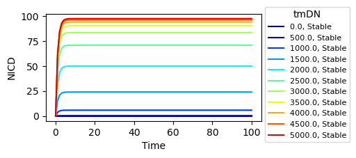 Fig 1.1 B: 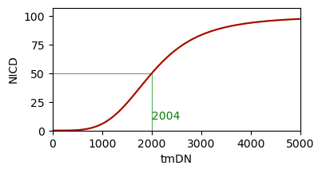

Fig 1.1 A: $NICD$ production under varying input ($tmDN$ between 0 and 5000). Under default conditions, without cis-interactions (no contribution to the $Ni_{prod}$ Eq. from $cmDN$), $NICD$ ranges from 0 to 100 growing proportionally with $tmDN$. All timeseries reach a stable state at or before step 5 (5'), 1/2 of the maximum value is reached before step 2. In this way, we ensure that the NICD value will be maximal (relatively to the input) during of each CC3D call (which steps the Antimony model for 10 steps = 10') 

Fig 1.1 B: Steady state values across the $tmDN$ range. As expected, the response curve is sigmoidal with 1/2 maximal speed at $tmDN$ = hMni = 2000.

---
---

## S 2: Definition of DLL4, JAGGED1 (ligands), and NOTCH1 (receptor) dynamics

### 2.1 NOTCH 1 ($N1$) dynamics: Explanation
$N1$ production is proportional to its basal production rate ($bN1$) and a scaling parameter $sc$. 

$N1$ degradation is the sum of a mass action dependent on $kdn1$ (rate of receptor recycling/ degradation), and a hill function mirroring NICD production rate and representing the amount of $N1$ used in trans and cis interactions.

*Note:* By adding an Hp term depending on HES 1 $N1$ production becomes inducible.

### 2.1 $N1$ dynamics: Example

Fig 2.1 A: 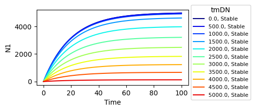 Fig 2.1 B: 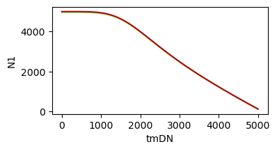

Fig 2.1 A: $N1$ production under varying input ($tmDN$ between 0 and 5000). With $tmDN$ = 0 the production rate is maximal platoeing at 5000 units (under default parameter settings, $bN1$ = 1 and $Kdn1$ = 0.05). All timeseries reach half maximal value at step 14 = 14'. With increasing $tmDN$ the steady state amount of $N1$ decreases because the second term in the degradation reaction becomes relevant, to the point that with $tmDN$ = 5000, $N1_{prod}$ ~ $N1_{deg}$.

*Note*: By increasing $tmDN$ above 5000 the $N1_{prod}$, $N1_{deg}$ system yields negative production rates and negative $N1$ which is not biologically meaningful!!! Practically, the value $tmDN$ + $cmDN$ is limited by the available $N1$ within the cell (See section 4 covering cis-interactions, and the CC3D implementation, to see how $cmDN$ and $tmDN$ are calculated). Therefore, negative production rates are practically impossible within the constraints of the simulation. 

Fig 2.1 B: Steady state values across the $tmDN$ range highlighting the decrease in total cellular $N1$ with increasing $tmDN$

---

### 2.2 DLL4 ($D4$) dynamics: Explanation
$D4$ production is defined by a negative hill function where $D4$ basal production rate ($bD4$) is limited in presence of HES 1 ($H1$, S X), and a scaling parameter $sc$. 

$D4$ degradation is a mass action dependent on current $D4$ plus the $D4$ donated in trans in the previous iteration (calculated in the cell-based simulation in CC3D), and regulated by the parameter $Kdd4$

### 2.2 $D4$ dynamics: Example

Fig 2.2 A: 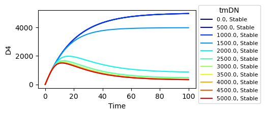 

Fig 2.2 B: 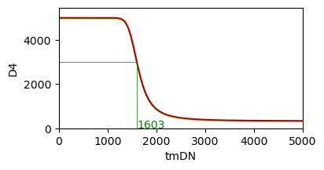

Fig 2.2 A: $D4$ production under varying input ($tmDN$ between 0 and 5000). With $tmDN$ = 0 the production rate is maximal platoeing at 5000 units (under default parameter settings, $bD4$ = 1 and $Kdd4$ = 0.05). All timeseries reach half maximal value before step 14 = 14'. With increasing $tmDN$ and corresponding increase in $H1$ (section 2 X), the reaction is strongly inhibited (Fig 2.2 B). Note that, due to the delay in $H1$ processing, the total $D4$ levels start decay significantly after 20-30', indicating that the lateral inhibition signal must be "high" for sufficient time to exert its full effects.

Fig 2.2 B: Steady state values across the $tmDN$ range highlighting the sharp decrease in total cellular $D4$ with $tmDN$ values > ~1600.

---

### 2.3 JAGGED 1 ($J1$) dynamics: Explanation
$J1$ production depends on a basal production rate ($bJ1$ = 0 in default conditions), and it is inducible by HES 1 (proportional to a positive Hill function of $H1$ at a max rate = $VmJ1$).

$J1$ degradation is a mass action dependent on the current $J1$ level and the $J1$ donated in trans in the previous iteration, regulated by the parameter $Kdj1$.

### 2.3 $J1$ dynamics: Example

Fig 2.3 A: 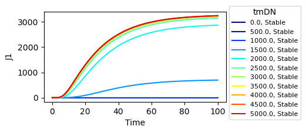 Fig 

2.3 B: 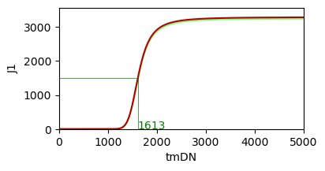

Fig 2.3 A: $J1$ production under varying input ($tmDN$ between 0 and 5000). With $tmDN$ = 0 the production rate is 0 (under default parameter settings, $bJ1$ = 0 and $Kdj1$ = 0.05). With increasing $tmDN$ and corresponding increase in $H1$ (section 2 X), the reaction is promoted (Fig 2.3 B). Note that, due to the delay in $H1$ processing, the total $J1$ levels start increasing significantly after 20-40' (T 1/2 max for all series 25-40')
, indicating that the lateral inhibition signal must be "high" for sufficient time to exert its full effects.

Fig 2.3 B: Steady state values across the $tmDN$ range highlighting the sharp increase in total cellular $J1$ with $tmDN$ values > ~1600.

---
---

## S 3: Definition of HES1 dynamics
Within the NED model HES 1 production can be regulated by two alternative sub-models (with or without autoregulatory feedback).
So far we have only used examples without autoregulation. In section  3.2 we will introduce the alternative model with HES autoregulatory feedback.

### 3.1 HES1 ($H1$) dynamics without autoregulation: Explanation
In absence of autoregulation, HES 1 ($H1$) production depends on a basal production rate ($bH1$ = 0.0 in default conditions), and it is inducible by $NICD$ (proportional to a positive Hill function of $NICD$ at a max rate = $VmH1$, and K<sub>0.5</sub> = $hMh1$).

$H1$ degradation is a mass action dependent on the current $H1$ level and is regulated by the parameter $Kdh1$.

### 3.1 $H1$ dynamics without autoregulation: Example
*Note*: We scan over the $tmDN$ input parameter (rather than $NICD$) to keep the input constant during the simulation without changing the model string. We omit the study of the $H1_{prod}$, $H1_{deg}$ system in isolation as it closely mirror that of $NICD$ shown in section 1.1. Thus,  the example code, demonstrate the output of the combined system $NI_{prod}$, $NI_{deg}$ and $H1_{prod}$, $H1_{deg}$.

Fig 3.1 A: 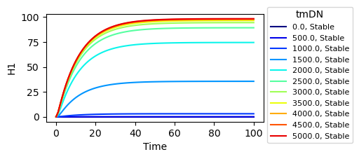 

Fig 3.1 B: 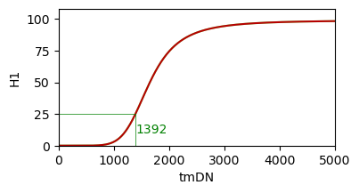

Fig 3.1 A: $H1$ production under varying input ($tmDN$ between 0 and 5000, recall from Ex 1.1 that this yields constant $NICD$ in the 0-100 range). With $tmDN$ = 0 the production rate is 0 (under default parameter settings, $bH1$ = 0 and $Kdh1$ = 0.09). With increasing $tmDN$ and corresponding increase in $NICD$ (section 1), the reaction is promoted (Fig 3.1 B). The delay in $NICD$ processing is minimal, thus the total $H1$ level starts increasing significantly after 9-10' (T 1/2 max for all series 9-10').

Fig 3.1 B: Steady state values across the $tmDN$ range highlighting the sharp increase in total cellular $H1$ with $tmDN$ values > ~1400.

---

### 3.2 $H1$ dynamics with autoregulation: Explanation

### 3.2 Analysis of the HES 1 sub-model dynamics 
To facilitate understanding the HES 1 system dynamics we start by studying the sub-model in isolation in the following example.
We rewrite the model string to remove the scaling parameters used to plug the HES 1 sub-model into the NED model. We also write all equations explicitly.

To facilitate the analysis of the HES 1 sub model we have defined a dedicated runner.

#### 3.2 HES 1 sub-model: Explanation
Parameters:

$vm_{prna}$ is the v<sub>max</sub> of the competitive Hill function for the $mRNA_{prod}$ reaction.  
$K$ is the K<sub>0.5</sub> used for both positive and negative regulation, it is possible to chose different Ks for each interaction, however in absence of experimental evidence to support specific choice, and to make all interaction dimensionally compatible, we set all Ks equals to 0.5 (K<sub>0.5</sub>). $hh1$ is the Hill (cooperativity) coefficient for HES inhibition. The Hill coefficients for the other regulators are implicitly set to 1. 

$kdel$ is the Vmax of the Michaelis-Menten equations (with Km = $K$) representing the delay in the protein production process.

$kdh$ is the Vmax of the degradation rate equation, a Michaelis-Menten with Km = $K$

---
Reactions:

$pmRNA_{prod}$ : Process the input signal $NICD$ (scaled to 0-1) regulating the production of pre-mRNA. As proposed (ref), the reaction is promoted by NICD but it is negatively regulated by the final product $HES$. Mathematically, to have the HES sub model oscillating as predicted, and experimentally observed in previous studies, we need both autoregulation, and delay in the processing chain. In addition, strong non-linearities ($hh1$ = 8) in the chain, facilitate stable oscillations.

$mRNA_{prod}$, $pHES_{prod}$, $HES_{prod}$ : This chain of reactions introduces a global delay towards the production of the final product (active $HES$). Biologically, the potential sources of delayed protein production are several and a few have been proposed to justify the oscillatory behaviour of the HES system. 

$mRNA_{prod}$ : It has been demonstrated that HES1 mRNA processing is delayed due to long introns-processing.

$mRNA_{deg}$ : For simplicity, we might have chosen to directly chain the mRNA $mRNA_{prod}$ and $pHES_{prod}$, without the need for a $mRNA_{deg}$ law. However, biologically, mRNA is not consumed during protein production, but it is degraded overtime via independent mechanisms.  

$pHES_{prod}$ and $HES_{prod}$: Translation and post translational protein modifications, or nuclear import for TF, are all likely source of delay.

The rate of HES degradation ($HES_{deg}$) is a Michaelis-Menten equation representing rapid degradation of the active protein as previously reported (another precondition to facilitate stable oscillations).

#### 3.2.1 $HES$ dynamics:
We first take a look at how the model responds under the default parameters setting

Fig 3.2.1 A 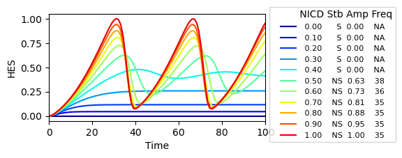 

Fig 3.2.1 B 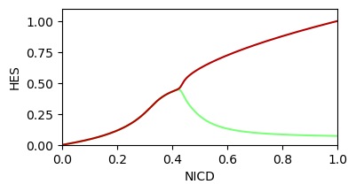

We notice that:
- The maximum values for $HES$ increase with increasing input $NICD$ (Fig 3.2.1 A).
- With $NICD$ values < ~ 0.3, the system reaches a steady state production of $HES$.
- With $NICD$ values > ~ 0.3, the system is unstable and  the total $HES$ oscillates (Fig 3.2.1 B).
- The T to reach half maximal values is ~100-120'. a delay which is compatible with previously reported period oscillations of HES protein.

Parameters estimation:
- As the HES sub-model is non dimensional we want its output to scale in the 0-1 range.
- We want stable HES oscillations to occur under at least a fraction of input NICD (range 0-1).
- We want the oscillations to have a period of ~100-120'
- The amplitude of the oscillations has not been strictly defined, however, available experimental and in silico data point at amplitudes covering 70-100% of the whole range.

We want to estimate the model parameters ($vm_{prna}$, $K$, $hh1$, $kmrp$, $kmrd$, $kphp$, $khp$, and $khd$), under these constraints.

---

## 3.2.2 Final Parameter Set Used in the Paper

The following compact model string summarizes the solution of our parameter search for the HES1 autoregulatory sub-model, as used in the main text:

```antimony
vm_prna = 0.1; hh1 = 8; K = 0.5;                             # Parameters for the competitive hill function
pmRNA_prod: => pmRNA; Hc(vm_prna, NICD, pmRNA, HES, K, 1, K, 1, K, hh1); # Hc for mRNA transcription
kmrp = 0.1; kmrd = 0.05;                                     # Parameters for mRNA processing and degradation
mRNA_prod: pmRNA => mRNA; MM(pmRNA,kmrp,K);                  # Michaelis-Menten reaction for mRNA processing
mRNA_deg: mRNA => ; MM(mRNA,kmrd,K);                         # Michaelis-Menten reaction for mRNA degradation
kphp = 0.1; khp = 0.1; khd = 0.075;                          # Parameters for protein translation and degradation
pHES_prod:  => pHES; MM(mRNA,kphp,K);                        # Michaelis-Menten reaction for inactive protein translation
HES_prod: pHES => HES;  MM(pHES,khp,K);                      # Michaelis-Menten reaction for active protein translation
HES_deg: HES => ; MM(HES,khd,K);                             # Michaelis-Menten reaction for active protein degradation
```

This parameter set was selected to ensure:
- Robust oscillatory behavior of HES1 in response to NICD input, consistent with experimental observations.
- Oscillation period and amplitude compatible with published data (period ~100-120', amplitude covering most of the normalized range).
- Sufficient nonlinearity ($hh1 = 8$) to support stable oscillations, as required by the biological system.
- Balanced rates for mRNA and protein processing/degradation, ensuring that delays and feedbacks are biologically plausible and mathematically stable.

This compact form is suitable for both simulation and analytical study, and was used for all results and figures in the main manuscript.

---

# Supplementary Figures: Section 3.2 HES1 Autoregulatory Sub-model

Below are all figures referenced in Section 3.2, with brief comments on their meaning. For each, the code used to generate the figure is indicated for reference.

---

**Fig 3.2.1 A:** HES1 dynamics in response to increasing NICD input. Maximum HES1 levels increase with NICD and oscillations emerge above a threshold.  


---

**Fig 3.2.1 B:** Steady-state and oscillatory regimes of HES1 as a function of NICD. Oscillations emerge above a threshold.  


---

**Fig 3.2.2 A:** Sensitivity analysis: effect of vm_prna (maximal transcription rate) on HES1 oscillations.  
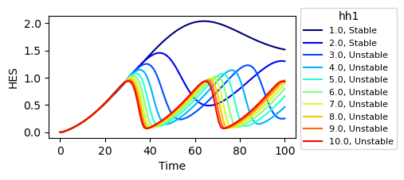

---

**Fig 3.2.2 B:** Sensitivity analysis: effect of the Hill coefficient (hh1) on HES1 oscillatory behavior.  
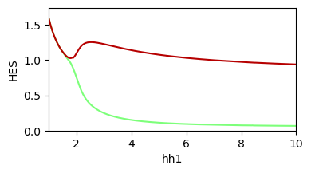

---

**Fig 3.2.3 A:** Sensitivity analysis: effect of K (affinity parameter) on HES1 oscillations.  


**Fig 3.2.4:** Additional phase portraits and parameter sweeps for HES1 sub-model.  
See code in Section 3.2 for details on generating these figures.

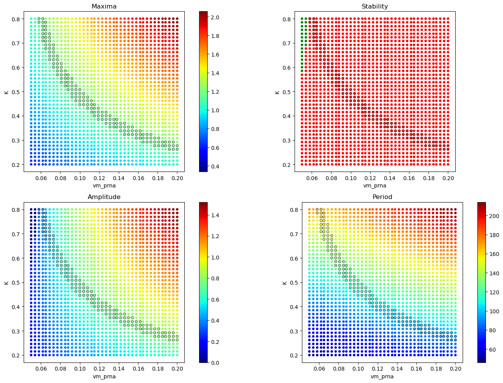

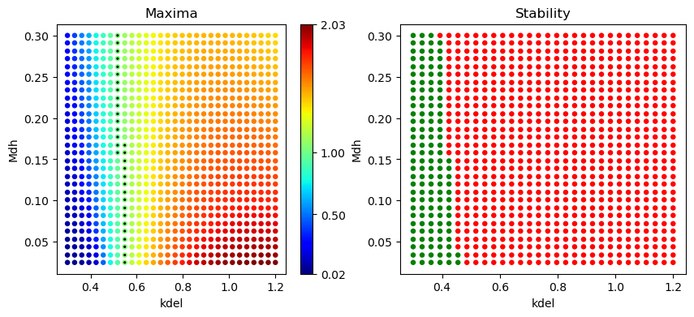

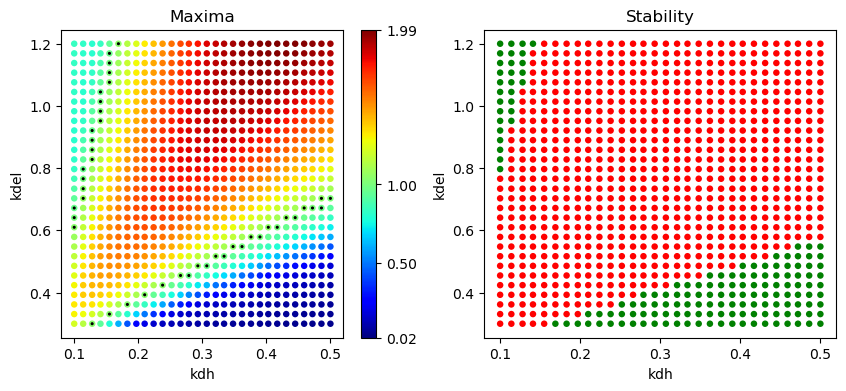

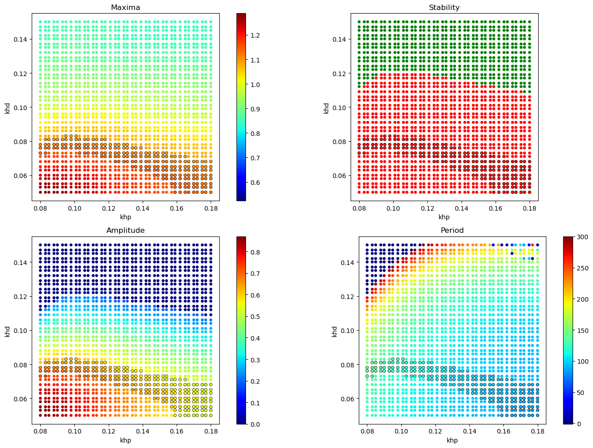

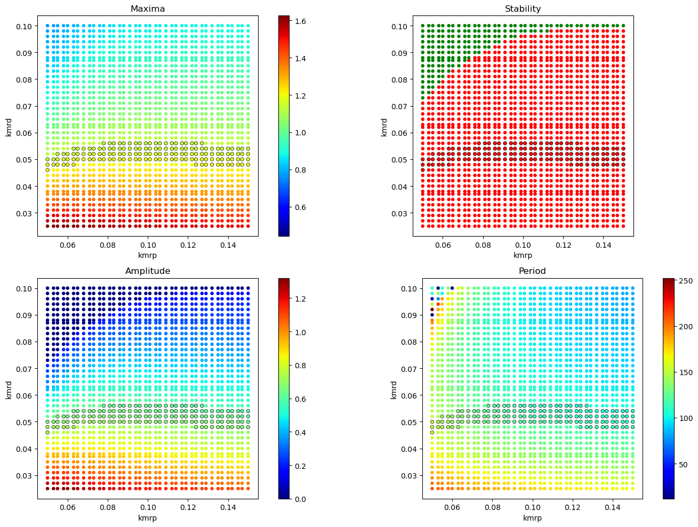

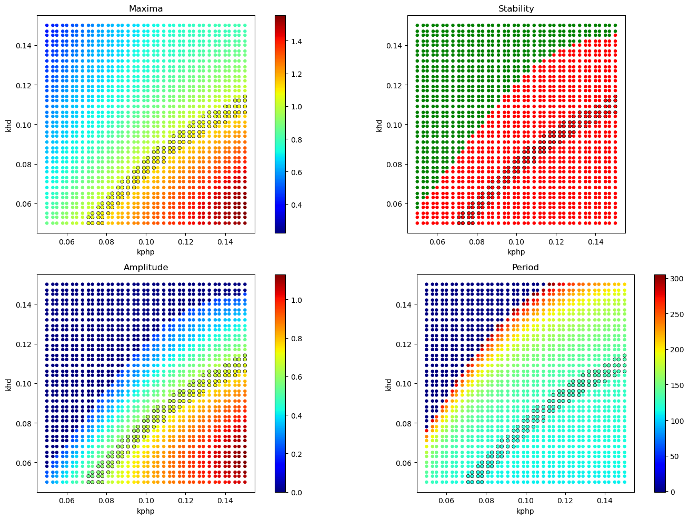
