# Supplementary Note 1: Step-by-step NED model definition

## Introduction: species selection rationale

- Global criterion: we selected NOTCH pathway (GO:0007219) components known to be expressed in endothelial cells, prioritizing literature and single-cell atlases (e.g., Endotheliomics EC atlas, https://endotheliomics.shinyapps.io/ec_atlas/).
- Ligands: Dll4 (Gene ID: 54567) is the dominant endothelial Notch ligand; spleen-specific EC express Dll1, but as a tissue-restricted ligand it is omitted. Jagged1 (Gene ID: 182) and Jagged2 (Gene ID: 3714) are both detected, but evidence for endothelial roles of Jagged2 (Gene ID: 3714) are sparse and largely relative to hematopoietic sytem; following prior models (e.g., Boareto et al PNAS 2015) we include one  Jagged-family (Jagged1, *J1*), and one Dll-family (Dll4, *D4*) ligands modeling competition explicitly.
- Receptor: NOTCH1 (Gene ID: 4851) is ubiquitously expressed across murine endothelial beds; NOTCH4 (Gene ID: 4855) is also broad except spleen. Lacking clear differential data, we assume overlapping function and model a single receptor specie *N1*.
- Signaling readout: NOTCH1-ICD (NICD hereafter) is the canonical second messenger. Jagged1-NOTCH1 interactions (cis and trans) are treated as non-productive for *NICD*, reflecting opposing endothelial effects of Dll4 vs Jagged1 (Benedito et al. Cell 2009); *D4*–*N1* interactions drive *NICD*.
- Transcriptional effector: *H1* represents HES1 (Gene ID: 3280), the only HES/HEY factor ubiquitously expressed across murine EC according to the Endotheliomics EC atlas and the marker of NOTCH activity used in Chesnais et al. JCS 2022, and the present work.
  
## Complete model string

### Utility functions
```
function Hp(Vm,S,hM,h) 
Vm*((pow(S/hM,h))/(1+pow(S/hM,h))) 
end

function Hc(Vm,A,R,Q,Ka,ha,Kr,hr,Kq,hq) 
Vm*((pow(A/Ka,ha))/(1+pow(A/Ka,ha)+pow(R/Kr,hr)+pow(Q/Kq,hq))) 
end

function Hn(bp,S,hM,h)
bp/(1+pow(S/hM,h))
end

function Ma(S,Kd)
S*Kd
end

function MM(S,vmax,Km)
vmax*S/(Km+S)
end
```

### Base parameters and timescale
```
model NDS()

# Timescale 1 tick= 1', in CC3D each MCS runs the SBML for 10 tiks= 10'               

# Scanned Parameters:
h1_auto = 0;   # If 1, use the auto-regulatory feedback of HES1, if 0, use the standard model without feedback
ps_bd4 = 0.0;
ps_bn1 = 0.0;
ps_bJ1 = 0.0;
ps_J1ind = 0.0;
ps_ja = 0.0;
ps_ni = 2000;
ps_Kdni = 0.0; 
ps_kconv = 0.0;
cr = 0;
```

### NICD Production Degradation
```
Vmni= 100/4; hMni:= ps_ni; Kdni:= ps_Kdni/4; tmDN=0; NICD = 0; 
NI_prod: => NICD; Hp(Vmni,(tmDN+cmDN),hMni,4);             # Eq (1) § 1
NI_deg: NICD => ; Ma(NICD,Kdni);                           # Eq (2) § 1
```

### Ligands/receptors production and degradation
```
# NOTCH1 expression, can be modifed to include HES1 inducibility
N1=0; VmN1= 250; hMn1=50; Kdn1=0.05; bN1:= 250;               

                        # N1 inducibility by HES1
N1_prod: => N1; Ma(1,bN1); # + Hp(VmN1,H1,hMn1,4));        # Eq (3) § 2

         # Basal degr  | Degradation of engaged N1 in trans and cis interactions
N1_deg: N1=> ; Ma(N1,Kdn1)+(tmDN*Hp(Kdn1,(tmDN+cmDN),hMni,4)); # Eq (4) § 2

# DLL4 expression repressed by HES1
D4=0; hMd4=50; Kdd4=0.05; bD4:= 250; dD4=0;                    

D4_prod: =>D4; Hn(bD4,H1,hMd4,4);                          # Eq (5) § 2
D4_deg: D4=> ; Ma(D4 + (dD4*D4/(1+D4)), Kdd4);             # Eq (6) § 2

# Jagged1 expression basal and inducible by HES1
J1=0; VmJ1:= amp * ps_J1ind; hMj1:= ps_ja; Kdj1= 0.05; dJ1= 0; bJ1:= 0; 

J1_prod: =>J1; Ma(1,bJ1) + Hp(VmJ1,H1,hMj1,4);             # Eq (7) § 2 
J1_deg: J1=> ; Ma(J1 + (J1*dJ1/(1+J1)), Kdj1);             # Eq (8) § 2
```

### HES 1 Without autoregulatory feedback
```
H1 = 0
hMh1=35; 
Kdh1 = 0.075; bH1 = 0.0; VmH1 = 7.5;
H1_prod: =>H1; h1_auto * (bH1 + Hp(VmH1,NICD,hMh1,2));        # Eq (9) § 3
H1_deg: H1=> ; Ma(H1,Kdh1);                                # Eq (10) § 3
```

### HES 1 WITH autoregulatory feedback
```
vm_prna = 0.1; hh1 = 8; K = 0.5;
pmRNA_prod: => pmRNA; (1-h1_auto) * Hc(vm_prna, NICD, pmRNA, HES, K, 1, K, 1, K, hh1); # Eq (11) § 3

kmrp = 0.1; kmrd = 0.05;                                        
mRNA_prod: pmRNA => mRNA; MM(pmRNA,kmrp,K);                # Eq (12) § 3
mRNA_deg: mRNA => ; MM(mRNA,kmrd,K);                       # Eq (13) § 3

kphp = 0.1; khp = 0.1; khd = 0.075; 
pHES_prod:  => pHES; MM(mRNA,kphp,K);                      # Eq (14) § 3
HES_prod: pHES => HES;  MM(pHES,khp,K);                    # Eq (15) § 3
HES_deg: HES => ; MM(HES,khd,K);                           # Eq (16) § 3

# Hes scaling
# H1 = 0
H1_scaling: => H1; (1-auto) * (HES * 100 - H1);            # Eq (17) § 3
```

### Cis ligand-receptor interactions
```
cDNi:= piecewise(D4, D4<N1, N1); # Chose the minimum of D4 and N1    
cJNi:= piecewise(J1, J1<N1, N1); # Chose the minimum of J1 and N1

# Relative proportion of cis interactions after trans interactions scaled by cr
crd:=cr*(1-(tmDN/(300+tmDN)));
kcd= 0.10; # Degradation rate of cis complexes
kconv:= ps_kconv; # Conversion rate of cDN complex to transcriptionally active cmDN

cDN_complex_prod: D4+N1 => cDN;  Ma(cDNi,crd); 
cmDN_prod_deg: cDN => cmDN; Ma(cDN,kconv) - 0.05 * cmDN;    # Eq (18) § 2.4
cDN_deg: cDN => ; Ma(cDN,kcd);                              # Eq (19) § 2.4

cJN_complex_prod: J1+N1 => cJN; Ma(cJNi,crd);               # Eq (20) § 2.4
cJN_deg: cJN => ; Ma(cJN,kcd);                              # Eq (21) § 2.4

end
```

## S 0: Utility functions
We start by defining convenience functions to be used throughout the model:

**Mass action function**
$$P' = S \cdot k$$
*P* is the product of the reaction, *S* is the substrate of the reaction, and *k* is the rate constant governing conversion of *S* to *P* (often used for first-order degradation/turnover).

**Michaelis–Menten function**
$$P' = V_{max} \cdot \left(\frac{S}{K_m + S}\right)$$
*V_{max}* is the maximal rate of the reaction, and *K_m* is the Michaelis constant (substrate concentration at which the reaction is at half maximal rate).

**Positive Hill function**
$$P' = Vm \cdot \left(\frac{S^h}{K_{0.5}^h + S^h}\right)$$
*Vm* is the maximal rate of the reaction, *h* is the Hill exponent (cooperativity), and *K_{0.5}* is the value of *S* at which the reaction is at half maximal rate. 

**Negative Hill function**
$$P' = \frac{bp}{1+\left(\frac{S}{hM}\right)^h}$$
*bp* is the basal production rate of the product *P* in absence of inhibition; *hM* is the inhibitory half-maximal constant and *h* is the Hill exponent.

**Competitive Hill function**
$$P' = Vm \cdot \left(\frac{A^h}{K_{0.5}^h + A^h + R^h}\right)$$
*A* and *R* are activator and repressor of the reaction respectively.

In the case where *A* and *R* have different cooperativity (Hill exponents), a naive extension would be:
$$P' = Vm \cdot \left(\frac{A^{ha}}{K_a^{ha} + A^{ha} + R^{hr} + Q^{hq}}\right)$$

However, this denominator is not unit-consistent unless each regulatory term is made dimensionless. We therefore scale each contribution by its corresponding half-maximal constant:
$$P' = Vm \cdot \left(\frac{(A/K_a)^{ha}}{1 + {(A/K_a)^{ha}} + {(R/K_r)^{hr}} + {(Q/K_q)^{hq}}}\right)$$

---

All utility functions are implemented explicitly in the Antimony model and reused across modules to maintain consistency between biological assumptions and mathematical realization.

---
---

## S 1: Definition of *NICD* dynamics

### 1.1 *NICD* dynamics: Model formulation

Antimony code

```
# NICD Production Degradation
Vmni = 25; 
hMni = 2000; 
Kdni = 0.25; 
tmDN = 0; 
NICD = 0;

NI_prod: => NICD; Hp(Vmni, (tmDN + cmDN), hMni, 4); 
NI_deg: NICD => ; Ma(NICD, Kdni);
```

*NICD* dynamics is described using a minimal activation–deactivation module implemented in the SBML/Antimony layer. The *NICD* variable represents a coarse-grained Notch signaling activity state, rather than an explicit molecular count of cleaved *NICD*. It captures the effective outcome of ligand–receptor engagement, γ-secretase–mediated cleavage, and nuclear accumulation.

*NICD* activation is modeled by a positive Hill function with maximal activation rate (*Vm_{ni}*), driven by the combined contribution of trans- and cis-mediated *DLL4*–*NOTCH1* interactions. The effective input to *NICD* activation is (*tmDN + cmDN*). Here, *tmDN* is computed in the CC3D environment as a contact-area–weighted measure of productive trans interactions with neighboring cells, while *cmDN* represents productive cis interactions computed within the SBML model (see Section 4).

The Hill constant (*hM_{ni}*) (default value 2000, expected aggregated input ~0-5000) defines the interaction strength required for half-maximal *NICD* activation, and the Hill exponent (fixed to 4) controls the steepness of the response. These parameters determine the sensitivity of *NICD* activation to ligand–receptor engagement.

*NICD* deactivation follows a first-order mass-action kinetics with rate constant (*K_{dni}*), representing an effective deactivation rate of the *NICD* signaling state. This term aggregates *NICD* degradation, nuclear export, and loss of detectable signaling activity into a single phenomenological process.

Together, these terms define a moderately fast-relaxing *NICD* module whose steady-state level reflects the balance of local ligand–receptor interactions, while its characteristic timescale (~20') is set by the effective activation and deactivation rates. Parameter values are calibrated using characteristic timescales extracted from γ-secretase inhibition and washout (DAPT) experiments in the present endothelial system (Fig 2 and S Fig1). Accordingly, (*V_{m,ni}*) and (*K_{dni}*) should be interpreted as effective activation and deactivation rates, rather than as biochemical rate constants of individual molecular steps.

The overall structure of this module is consistent with established NOTCH–Delta–Jagged1 models, where NICD acts as a rapidly equilibrating intracellular signal integrating cell–cell interactions. In the present model, *NICD* does not directly regulate ligand or receptor expression. Instead, *NICD* acts upstream of *H1*, which serves as the primary transcriptional effector. This separation introduces a delay between signaling activation and transcriptional response while preserving the role of *NICD* as the central signaling intermediate.

### 1.2 *NICD* dynamics: Example

Figures 1.1A and 1.1B illustrate *NICD* dynamics under variation of the trans-interaction input (*tmDN*), with cis interactions disabled (*cmDN* = 0).

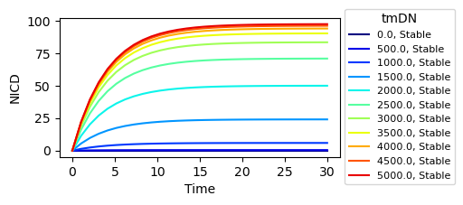
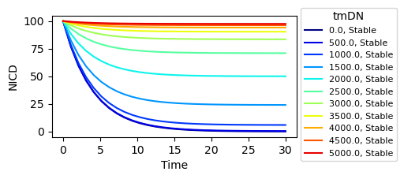

**Figure 1.1A** shows *NICD* time courses for (*tmDN*) values between 0 and 5000. For all inputs, *NICD* rapidly approaches a stable steady state on a timescale compatible with experimental estimates (~20'). 

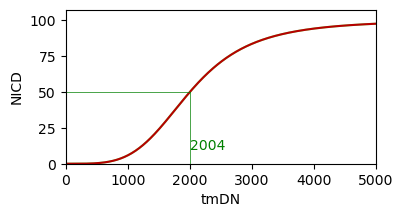

**Figure 1.1B** shows steady-state *NICD* levels as a function of (*tmDN*). The response is sigmoidal, with half-maximal activation near (*tmDN \approx hM_{ni} = 2000*), and saturation at *NICD* levels approaching the maximum defined by (*Vm_{ni}*). This parallels reference-model's architecture and ensures integration of -trans and -cis ligand–receptor interactions into a bounded signalling state.

---
---

## S 2: Definition of DLL4, Jagged1 (ligands), and NOTCH1 (receptor) dynamics

This section describes the intracellular dynamics of the NOTCH1 receptor (*N1*) and the ligands DLL4 (*D4*) and Jagged1 (*J1*). The overall regulatory architecture follows the logic of the reference NOTCH–Delta–Jagged1 model (Boareto et al., 2015), in which ligand and receptor expression are regulated downstream of NOTCH signaling to enable lateral inhibition and lateral induction. In the present model, this logic is preserved however *H1* is used as functional downstream effector, rather than *NICD* directly.

---

### 2.1 NOTCH1 (*N1*) dynamics: Model formulation

Antimony code
```

# NOTCH1 receptor production and degradation

# NOTCH1 expression, can be modifed to include HES1 inducibility
N1=0; VmN1= 250; hMn1=50; Kdn1=0.05; bN1= 250; 

                            # N1 inducibility by HES1
N1_prod: => N1; Ma(1,bN1);  # + Hp(VmN1,H1,hMn1,4);

             # Basal degr  | Degradation of engaged N1 in trans and cis interactions
N1_deg: N1=> ; Ma(N1,Kdn1) + (tmDN*Hp(Kdn1,(tmDN+cmDN),hMni,4));
```

*N1* production is a constant flux set by the basal rate *bN1* (here 250 *N1*-units per minute; model time = 1 min). In this reduced formulation transcription/translation are lumped into a single term; optional *HES1* inducibility can be switched on via the commented Hill term without altering the baseline.

*N1* degradation has two parts:  
- a first-order turnover term *Ma(*N1*,Kdn1)* with *Kdn1 = 0.05\,\mathrm{min}^{-1}*, giving a characteristic time *\tau \approx 20* min (half-life ~14 min) in the absence of interactions;  
- an interaction-dependent term proportional to *(*tmDN*+*cmDN*)* that removes receptors engaged in trans or cis binding. Notice that the exact law for *NICD* production is used here to capture the receptor effectively consumed in interactions.

Because steady state is set by the production/decay ratio (*N1^* \approx bN1/Kdn1 \sim 5{,}000* when *tmDN=*cmDN*=0*), the model lands in the *10^3*–*10^4* receptor regime targeted by Boareto et al. (2015). The exact transcription/translation numbers are not interpreted literally; what matters dynamically is the effective production–degradation balance on minute timescales. The interaction-dependent loss adds the expected negative feedback: higher signaling engagement lowers available receptor, in line with the reference model while remaining compatible with the hybrid SBML–CC3D coupling.

### 2.1 *N1* dynamics: Example

Fig. 2.1A and Fig. 2.1B show *N1* dynamics under variation of the trans-interaction input (*tmDN*).

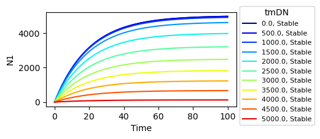

**Fig. 2.1A** shows *N1* time courses for *tmDN* values between 0 and 5000. In all cases, *N1* relaxes to a stable steady state on the order of tens of minutes, consistent with the *1/Kdn1 \approx 20* min intrinsic timescale.

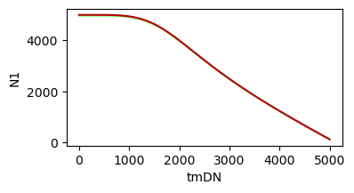

**Fig. 2.1B** reports steady-state *N1* levels as a function of *tmDN*.

With *tmDN = 0*, *N1* accumulates toward the basal steady state set by *bN1/Kdn1* on the *\sim 20* min timescale dictated by *Kdn1*. As *tmDN* increases, the interaction-dependent degradation term shortens the effective lifetime, producing a monotonic decrease in steady-state *N1*. For large *tmDN*, production and degradation nearly balance, leaving a low receptor pool.

Although the underlying ODE formulation can formally yield negative values if driven beyond its intended input range, such regimes are not accessible in practice. Both *tmDN* and *cmDN* are constrained by the available receptor pool through the CC3D coupling and cis-interaction logic (see Section 2.4), preventing biologically meaningless states.

---

### 2.2 *DLL4* (*D4*) dynamics: Model formulation

Antimony code
```
D4=0; hMd4=50; Kdd4=0.05; bD4:= 250; dD4=0;

# Basal Dll4 expression repressed by HES1
D4_prod: =>D4; Hn(bD4,H1,hMd4,4);

           # Basal d | Degradation of engaged D4
D4_deg: D4=> ; Ma(D4 + (dD4*D4/(1+D4)), Kdd4); 

```

*D4* production is a constant flux of *bD4 = 250* *D4*-units/min when fully derepressed. The negative Hill term *Hn(bD4,*H1*,hMd4,4)* attenuates that flux as *HES1* rises; with *hMd4 = 50*, repression is half-maximal around *H1 \approx 50*. As in Section 2.1, transcription and translation are lumped into this single term (model time = 1 min).

*D4* degradation is first-order with *Kdd4 = 0.05\,\mathrm{min}^{-1}* (same 20 min characteristic time, ~14 min half-life as *N1*). The interaction-dependent loss *(*dD4***D4*/(1+*D4*))* is supplied each CC3D iteration: as cells visit neighbours, engaged ligand is “donated” and accumulated into *dD4*, then passed into Antimony for that time step. The saturating form keeps this CC3D-derived term bounded at low copy number to avoid numerical issues. Relative to the reference model, Delta repression is preserved but mediated explicitly via *HES1* rather than *NICD*.

### 2.2 *D4* dynamics: Example

Fig. 2.2A and Fig. 2.2B illustrate *DLL4* dynamics under increasing *tmDN*.

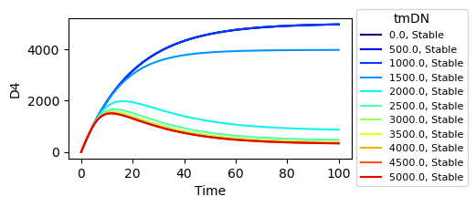

Fig. 2.2A shows *D4* time courses for *tmDN* values between 0 and 5000. For low *tmDN*, *HES1* remains low and *D4* accumulates toward its basal steady state set by *bD4/Kdd4* on the *\sim 20* min timescale defined by *Kdd4*. As *tmDN* increases, NOTCH signaling elevates *HES1*, which represses *D4* production and drives a sharp drop in *D4* levels after a delay of ~20–30 min, reflecting the intermediate *HES1* layer.

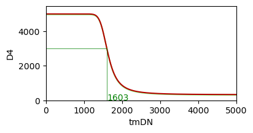

Fig. 2.2B shows steady-state *D4* levels as a function of *tmDN*.

---

### 2.3 Jagged1 (*J1*) dynamics: Model formulation

Antimony code
```
# Jagged1 expression basal and inducible by HES1
J1=0; VmJ1:= 250; hMj1:= ps_ja; Kdj1= 0.05; dJ1= 0; bJ1:= 0;

      # Basal production | HES1-induced production
J1_prod: =>J1; Ma(1,bJ1) + Hp(VmJ1,H1,hMj1,4); 

        # Basal degr | Degradation of engaged J1
J1_deg: J1=> ; Ma(J1 + (J1*dJ1/(1+J1)), Kdj1);
```

*J1* production combines a basal term (*bJ1*, zero by default) and an inducible Hill term *Hp(VmJ1,*H1*,hMj1,4)* (max 250 *J1*-units/min; half-max set by *hMj1=ps\_ja*). This encodes lateral induction: sustained NOTCH → *HES1* → *Jagged1*. If needed, basal production can be enabled by setting *bJ1>0* without altering the structure. As elsewhere, transcription/translation are lumped into this single flux (1 min model time).

*J1* degradation is first-order with *Kdj1 = 0.05\,\mathrm{min}^{-1}* (τ≈20 min, t½≈14 min) plus an interaction-dependent loss *(*J1***dJ1*/(1+*J1*))*. During each CC3D MCS, cells visit neighbours, allocate engaged *Jagged1*, and accumulate it into *dJ1*, which is then passed into Antimony for that step; the saturating form bounds this CC3D-derived term at low copy number. *Jagged1* competes with *DLL4* for receptor engagement in the spatial layer while remaining transcriptionally induced by *HES1*.

NOTE: In this model we assume that Jagged1 do not engage in productive trans or cis integarctions with NOTCH1 receptors, i.e., Jagged1 ligands do not contribute to NICD production. This assumption is based on experimental evidence demonstrating opposing effects of DLL4 and Jagged1 in angiogenesis (Benedito et al, 2009). By excluding Jagged1 from productive interactions, the model captures the dominant role of DLL4 in driving endothelial NOTCH activation and allows Jagged1 to modulate signaling indirectly through competition for receptor binding. 
Boareto et al. (2015) instead consider *Jagged1* as an activator and explicitly models lignads competition via Fringe (not included in the present model) mediated chanegs of receptor affinity. Via minor tweaks to the CC3D code this alternative hypothesis can be tested in our context. However, since the biological context of the present study and model is the endothelium we opted for the former assumption.

### 2.3 *J1* dynamics: Example

Fig. 2.3A and Fig. 2.3B show Jagged1 dynamics under increasing *tmDN*.

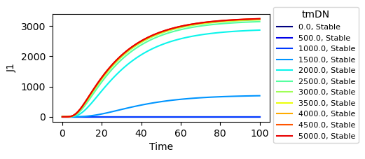

Fig. 2.3A shows *J1* time courses for *tmDN* values between 0 and 5000. For low *tmDN*, *HES1* remains low and *J1* stays near zero. As *tmDN* increases, NOTCH signaling elevates *HES1*, which induces *J1* production after a delay of ~20–40 min, reflecting the intermediate *HES1* layer. Basal production is set to 0 to model pure lateral induction, but it can be switched on by setting *bJ1 > 0* without altering the model structure.

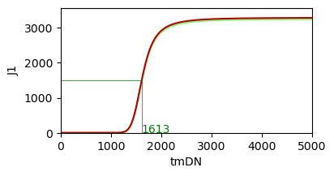
Fig. 2.3B shows steady-state *J1* levels as a function of *tmDN*.

With *tmDN = 0*, *HES1* stays low and the inducible term is near zero, so *J1* remains off (basal *bJ1=0*). As *tmDN* increases, NOTCH signaling raises *HES1*; after a ~20–40 min delay (*HES1* build-up plus the *1/Kdj1* decay timescale), *J1* turns on and relaxes on the ~20 min timescale set by *Kdj1*. When fully induced, *J1* approaches *VmJ1/Kdj1 \approx 5{,}000* before interaction-dependent losses from *dJ1* are applied. The sharp rise for *tmDN \gtrsim 1600* reflects lateral induction driven by sustained NOTCH activity, modulated by competition with *DLL4* in the CC3D layer.

---
### 2.4 Cis ligand–receptor interactions: Model formulation

Antimony code
```
## Cis ligand-receptor interactions
cDNi:= piecewise(D4, D4<N1, N1);  # min(D4, N1)
cJNi:= piecewise(J1, J1<N1, N1);  # min(J1, N1)

# Fraction of available ligand/receptor routed to cis after trans, scaled by cr
crd:= cr*(1-(tmDN/(300+tmDN)));
kcd = 0.10;          # Degradation rate of cis complexes
kconv = 0.1;    # Conversion rate of cDN to transcriptionally active cmDN

cDN_complex_prod: D4+N1 => cDN;  Ma(cDNi, crd);
cmDN_prod_deg:    cDN   => cmDN; Ma(cDN, kconv) - 0.05*cmDN;
cDN_deg:          cDN   => ;     Ma(cDN, kcd);

cJN_complex_prod: J1+N1 => cJN;  Ma(cJNi, crd);
cJN_deg:          cJN   => ;     Ma(cJN, kcd);
```


Key features and interpretation  
- Stoichiometric cap: *cD_{Ni}* and *cJ_{Ni}* take the minimum of ligand and receptor, so cis complex formation is substrate-limited.  
- Allocation vs trans: *cr_d* down-weights cis formation when trans engagement (*tmDN*) is high; *cr* is a phenomenological control parameter tuning the cis/trans balance.  
- Productive vs non-productive cis: *DLL4*–Notch cis (*cDN*) can convert to the transcriptionally active pool *cmDN* (feeds *NICD* via the *NICD* activation term), then decays at *0.05\\ \\text{min}^{-1}* (*t_{1/2}\\approx14* min). *Jagged1*–Notch cis (*cJN*) is non-productive for *NICD*; it forms and degrades with the same *k_{cd}*.  
- Turnover: *k_{cd} = 0.10\\ \\text{min}^{-1}* gives a *\sim*7 min half-life for unconverted cis complexes, keeping cis buffering fast relative to receptor/ligand synthesis.
- Fast-clearance rationale: the cis pathway is intended as a transient buffer/alternative routing, not a long-lived sink. The rapid decay plus per-MCS reset (below) keeps most signaling weight on trans unless *cr* and *k_{conv}* are set high, while still allowing cis contribution to *NICD* via *cmDN*.

CC3D implementation (per MCS, `EC_Connect_core.py`)
- At the start of each MCS, per-cell fields are zeroed: *tmDN=0*, *dD4=0*, *dJ1=0*.
- For each neighbor, trans “donation” is computed with surface-area weighting and *DLL4*/*Jagged1* competition (*kpDJ_1*, *kpDJ_2*), accumulating into the neighbor’s *dD4*/*dJ1* and the focal cell’s *tmDN*.
- These accumulated *dD4*/*dJ1* values are passed to Antimony, where they appear in the cis/trans terms for that time step.

No dedicated figures are provided for cis interactions; their effects appear indirectly in *NICD* and downstream *H1*/*D4*/*J1* dynamics through the *cmDN* contribution to *NICD* activation and cis sequestration of ligand/receptor.

In code (`EC_Connect_core.py` lines 198-241), each EC visits its neighbors, weights their ligands by shared surface area (C_area_fr), and splits receptor usage between Delta and Jagged competition: kpDJ1 = d4_contrib / (1 + d4_contrib + kJC*j1_contrib), kpDJ2 = 1 – kpDJ1 (with kJC=1). The neighbor accrues engaged ligand as dD4 += min(kpDJ1*d4_contrib, kpDJ1*n1_contrib) and dJ1 analogously, while the focal cell records productive trans signaling as tmDN += min(kpDJ1*d4_contrib, kpDJ1*n1_contrib). This per-MCS bookkeeping bounds donations by available N1, preserves ligand–receptor stoichiometry, and passes tmDN/dD4/dJ1 to the SBML layer before they are reset on the next MCS.


Reset convention in CC3D coupling  
At each CC3D Monte Carlo Step (MCS), cis complexes detected/accumulated are passed to Antimony for that step and then reset at the next MCS. This assumes cis complexes are short-lived: if not converted or consumed within the step, they are effectively dissociated and ligand/receptor become available again for the next interaction round.


---
---

## S3: Definition of *HES1* dynamics

Within the NED model, *HES1* dynamics can be described using two alternative sub-models, either with or without autoregulatory feedback. In section 3.1, we focus on the formulation without autoregulation, while the feedback-enabled variant is introduced in Section 3.2.

### 3.1 *HES1* (*H1*) dynamics without autoregulation: Model formulation

Antimony code
```
H1 = 0; hMh1=35; Kdh1 = 0.075; bH1 = 0.0; VmH1 = 7.5;
 # Basal production | NICD-induced production
H1_prod: =>H1; (bH1 + Hp(VmH1,NICD,hMh1,2)); 

H1_deg: H1=> ; Ma(H1,Kdh1); 
```

In the absence of autoregulation, *HES1* (*H1*) production is driven by *NICD*-dependent activation and an optional basal production term. Under default conditions, basal production is set to zero (*bH1 = 0*), and *HES1* activation is entirely induced by *NICD*.

*HES1* production is modeled using a positive Hill function of *NICD* with maximal activation rate *V_{m,*H1*}* and half-maximal activation constant *hM_{*H1*}*. The Hill exponent (fixed to 2) controls the smoothness of the response. This formulation captures the effective transcriptional activation of *HES1* downstream of *NICD* signaling.

*HES1* degradation follows first-order mass-action kinetics with rate constant *K_{dH1}*, representing an effective deactivation rate that aggregates protein turnover, nuclear export, and loss of transcriptional activity. Together, these terms define a reduced *HES1* module that integrates *NICD* signaling over longer timescales than *NICD* itself.

Parameter values are chosen to place *H1* dynamics on an hour-scale, consistent with experimental observations of delayed inhibition and slow recovery following γ-secretase perturbation. As for *NICD*, *H1* parameters are interpreted as effective activation and deactivation rates, rather than as biochemical constants of individual molecular processes.

### 3.1 *HES1* (*H1*) dynamics without autoregulation: Example

To illustrate *HES1* dynamics, we vary the trans-interaction input *tmDN* while keeping cis interactions disabled (*cmDN = 0*). As shown in Section 1, this approach yields stable *NICD* levels in the range 0–100.

Fig 3.1 A: 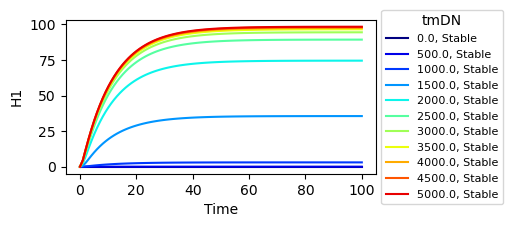 

**Figure 3.1A** shows *HES1* time courses for *tmDN* values between 0 and 5000. For low *tmDN*, *NICD* remains low and *HES1* stays near zero. As *tmDN* increases, *NICD* activation induces *HES1* production, which rises gradually toward a stable steady state. *HES1* accumulation follows that of *NICD*, occurring on a slower timescale (~1 hour) consistent with experimental perturbation data.

Fig 3.1 B: 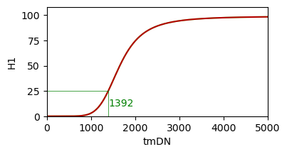

**Figure 3.1B** shows steady-state *HES1* levels as a function of *tmDN*. The response is sigmoidal, with a sharp transition occurring for *tmDN \approx 1400*, corresponding to the *NICD* activation threshold. At high *tmDN*, *H1* saturates at a level determined by the balance between *NICD*-driven production and first-order degradation.

This formulation ensures a clear separation of timescales between rapid *NICD* signaling and slower *HES1* response, consistent with experimental perturbation data.

---

### 3.2 *H1* dynamics with autoregulation: Model formulation

In addition to the reduced *HES1* formulation described in Section 3.1, the NED model includes an alternative *HES1* sub-model incorporating negative autoregulation in addition to delayed production. This formulation is motivated by extensive experimental and theoretical evidence showing that *HES1* exhibits oscillatory dynamics driven by transcriptional repression combined with intrinsic delays in gene expression.

The autoregulatory *HES1* module is parameterized to be consistent with the experimentally observed *HES1* response timescales, while explicitly capturing sustained oscillations—that cannot be represented by the reduced first-order model. In particular, parameters are chosen to have *HES1* activation and deactivation occurring on hour-scale times, in agreement with DAPT perturbation experiments.

To facilitate interpretation, we analyse the *HES1* sub-model in isolation. For this purpose, scaling parameters used to couple *HES1* to the full NED model are removed, and all reactions are written explicitly. A dedicated simulation runner was implemented to characterize the intrinsic dynamics of this sub-system.

---

### 3.2.1 *HES1* autoregulatory sub-model: formulation

Antimony code
```
# Immature mRNA (pmRNA) production, processing, and degradation
vm_prna = 0.1; hh1 = 8; K = 0.5; 

# Competitive hill function for inactive mRNA transcription
pmRNA_prod: => pmRNA; Hc(vm_prna, NICD/100, pmRNA, HES, K, 1, K, 1, K, hh1); 

# Mature mRNA (mRNA) production, processing, and degradation
kmrp = 0.1; kmrd = 0.05; 

mRNA_prod: pmRNA => mRNA; MM(pmRNA,kmrp,K); # Michaelis-Menten reaction for mRNA processing
mRNA_deg: mRNA => ; MM(mRNA,kmrd,K); # Michaelis-Menten reaction for mRNA degradation

# Inactive protein (pHES) production, active protein (HES) production, and active protein degradation
kphp = 0.1; khp = 0.1; khd = 0.075; 

pHES_prod:  => pHES; MM(mRNA,kphp,K); # Michaelis-Menten reaction for inactive protein translation
HES_prod: pHES => HES;  MM(pHES,khp,K); # Michaelis-Menten reaction for active protein translation
HES_deg: HES => ; MM(HES,khd,K); # Michaelis-Menten reaction for active protein degradation
```

#### Parameters

- *v m_{prna}*: maximal rate of pre-*mRNA* transcription.
- *K*: half-maximal activation constant (*K_{0.5}*), shared across regulatory reactions.
- *h_{*H1*}*: Hill coefficient controlling the strength of *HES1* autorepression.
- *k_{mrp}*, *k_{mrd}*: maximal rates for *mRNA* processing and degradation.
- *k_{php}*, *k_{hp}*, *k_{hd}*: maximal rates for protein translation, maturation, and degradation.

All reactions use Hill or Michaelis–Menten kinetics with a common *K_{0.5}* value. In the absence of experimental evidence supporting distinct affinities, this choice limits parameter redundancy while preserving the strong nonlinearities required for oscillatory behavior.

NOTE: Small caps ks (e.g., *kmrp*) denote maximal rates used in Michaelis–Menten reactions, while regular caps (e.g., *K*) denote half-maximal constants.

---

### 3.2.2 Reaction structure and biological interpretation

#### Pre-*mRNA* transcription  
The reaction *pmRNA_{prod}* integrates the *NICD* input signal (scaled to the range 0–1) and is negatively regulated by the final product, *HES1*. Transcription is promoted by *NICD* and competitively inhibited by *HES1* through a Hill function. Strong cooperativity (*h_{*H1*}=8*) is required to sustain oscillatory behavior, consistent with established theoretical and experimental models of the NOTCH–*HES* regulatory network.

#### Delayed production chain  
The reactions *mRNA_{prod}*, *pHES_{prod}*, and *HES_{prod}* form a sequential processing chain that introduces an effective delay between transcriptional activation and accumulation of active *HES1* protein. This delay represents a lumped contribution from multiple biological processes, including intron processing, translation, post-translational modification, and nuclear import.

In principle, a reduced formulation with fewer intermediate species could reproduce delayed negative feedback. However, we explicitly represent multiple processing steps to (i) distribute delay across biologically plausible stages, (ii) introduce multiple sources of dynamical buffering and noise, and (iii) avoid reliance on a single artificial delay term. This formulation allows oscillations to emerge robustly over a broader parameter range and makes the model less sensitive to fine-tuning of individual rates. Additionaly, this makes the model open to future extensions if data supporting finer parameterization become available.

#### Degradation  
Both *mRNA* and active *HES1* are degraded via Michaelis–Menten kinetics. Rapid *HES1* turnover relative to its production delay is a known prerequisite for sustained oscillations in delayed negative feedback systems and has been reported experimentally for *HES* family proteins.

#### Model granularity and parameter exploration  
The *HES1* autoregulatory sub-model is non-dimensional, with output scaled to the range 0–1. Parameters were explored systematically (see characterization notebook) to identify regimes that satisfy the following qualitative constraints:

- Stable *HES1* oscillations occur for a subset of *NICD* input values within the biologically relevant range (0–1).
- Oscillation periods are approximately 100–120 minutes (considering our time unit is 1').
- Oscillation amplitudes span a large fraction (≈70–100%) of the available dynamic range.
- Transient activation and relaxation times remain compatible with experimentally observed hour-scale *HES1* responses.

Under these constraints, we estimate the model parameters (*v m_{prna}*, *K*, *h_{*H1*}*, *k_{mrp}*, *k_{mrd}*, *k_{php}*, *k_{hp}*, and *k_{hd}*) as effective rates capturing aggregated biological processes rather than realistic kinetic constants of individual molecular steps.

---

### 3.2.3 Dynamical behavior of the autoregulatory *HES1* module

We examine the response of the isolated *HES1* sub-model to constant *NICD* input.

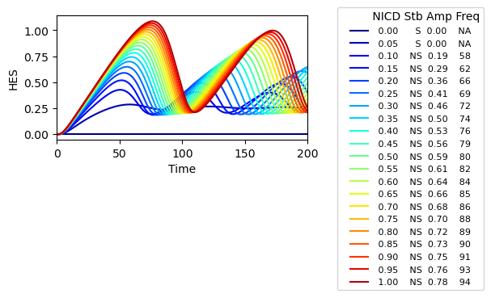

**Figure 3.2.1A** shows *HES1* time courses for increasing *NICD* levels.  

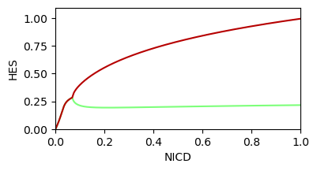

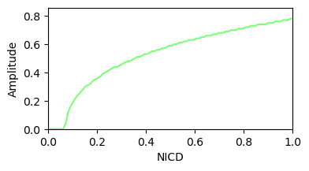
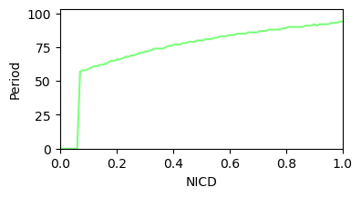

**Figure 3.2.1B** summarizes the corresponding steady or oscillatory regimes.

The following behaviors are observed:

- For low *NICD* input (*NICD \lesssim 0.05*), *HES1* converges to a stable steady state.
- For higher *NICD* input (*NICD \gtrsim 0.1*), the system transitions to sustained oscillations.
- The rise time toward maximal *H1* levels is on the order of 1–2 hours, consistent with experimentally observed *HES1* activation following NOTCH stimulation.
- Oscillation periods fall in the range of 100–120 minutes, in agreement with previously reported *HES1* oscillations in endothelial and neural systems.

Thus, the autoregulatory module preserves the experimentally constrained timescale of *HES1* activation and extends the model to capture oscillatory regimes that emerge from delayed negative feedback.

---

### Parameter scans and selection of the final *HES1* autoregulatory regime

To identify a parameter regime supporting biologically plausible *HES1* dynamics, we performed systematic parameter scans of the autoregulatory sub-model, varying transcriptional strength (*Vm_{prna}*), cooperativity (*hh1*), degradation rates (*kdh*, *kmrd*), and delay-associated processing rates (*kmrp*, *kphp*, *khp*). Rather than optimizing a single quantitative loss function, we explored the resulting dynamical behaviors under a set of qualitative constraints motivated by experimental observations and prior modeling studies. In particular, we required (i) *HES1* output to remain normalized within the 0–1 range, (ii) oscillations to occur for at least a subset of *NICD* inputs, and (iii) oscillation periods to be *\approx 100–120'*.

Phase plots generated from these scans reveal that sustained oscillations arise only within a restricted region of parameter space, where strong negative autoregulation is combined with an appropriate balance between production delay and *HES1* turnover. In these plots, marked points corresponding to a maximal *H1* level of *\approx 1* define a reference manifold  to compare dynamical regimes independently of absolute scaling. Along this manifold, oscillation period and waveform vary smoothly with parameter values. The final parameter set used in the paper was selected from this region based on visual inspection of time courses and phase portraits, as a representative solution that satisfies the imposed constraints and exhibits robust oscillatory behavior without fine tuning. Via this approach we compromise between biological plausibility, model simplicity, and flexibility as parameters cannot be uniquely constrained by the available experimental data.


